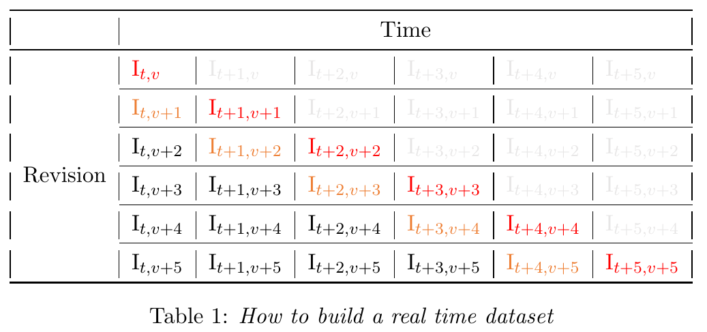

# Revisions Analysis

Economic indicators are often revised many times after their first publication. This is done since Eurostat and the other statistical agencies put special attention on the quality of the data and at the same time try to  back the users’ need of disposing of the most recent data. In particular, there exists a trade-off between the timeliness of data publication, on the one hand, and the reliability and stability of the data on the other. The principles of Eurostat’s publication policy, which are reported in Eurostat’s Code of Practice (Eurostat 2017), are intended to balance the need of reliability and accuracy with that of timeliness. As a first step, Eurostat publishes early releases of the statistics, in order to meet the timeliness principle; afterwards, it revises and updates them, as new information becomes available. The publishing of the early versions of the data allow to meet the timeliness principle: as Principle 13 states, “European Statistics are released in a timely and punctual manner”, and “a standard daily time for the release of statistics is made public”. Then, to address potential inaccuracies in the early versions, “statistical processes are routinely monitored and revised as required” and “revisions follow standard, well-established and transparent procedures” (Principle 8).

Revisions are the differences between the early and the latest value of the statistics and can be considered as a measure of the data reliability. Principle 12 in Eurostat (2017) states that the aim of the European Statistics is to “... accurately and reliably portray reality”, through the integration of different sources of data and revisions which are “...regularly analysed in order to improve data sources, statistical processes and outputs”. 

## Classification of revisions

Revisions can be carried out for different reasons (Eurostat 2014):

i) Incorporation of additional data: e.g. late responses to surveys, replacement of forecasts with available data, incorporation of data which more closely matches concepts and definitions;

ii) Updating of routine adjustment/treatment or compilation: e.g. adjusting for seasonal factors, changing the base year for the time series;

iii) The introduction of new methods and concepts: e.g. improvements in the estimation methods, changes in classifications, introduction of new definitions;

iv) Correction of errors caused by the incorrect management of source data and/or by wrong answers given by survey respondents.

Revisions occur periodically shortly after the first publication, usually after a few months, and are done to add new information and replace forecasts with actual data. Moreover, periodic revisions occur on a longer time span for wider adjustments. When this is the case, the schedule is regular, defined ex-ante and communicated to the public. Instead, in the case of unexpected errors, revisions are carried out as soon as possible, and are therefore occasional and timely. To sum up, we can distinguish different kind of revisions according to their timing (Eurostat 2014):

i) Routine revisions, generally regarding recent periods;

ii) Annual revisions, carried out when more information emerges;

iii) Major revisions occurring at longer intervals (3/4 years), which depend on the change of classifications, base periods and so on. They require the re-computation of the whole time series;

iv) Unexpected revisions, usually done when previous errors are discovered.

## Definition of revisions

Given a particular indicator (that is, a time series) and two subsequent estimates of it, which both refer to the same period $t$ (for example, a given month or quarter) a revision can be defined as 

$$
R_t = L_t - P_t ,
$$
where $P_t$ is a a preliminary (or earlier) estimate and $L_t$ a later (more recent) estimate of the indicator.  This definition of revision is used when dealing with indicators measured in growth rates (period-on-period or year-on-year growth rates). Instead, when dealing with revisions to values in level, we define revisions in relative terms: 

$$
R_t = 	\frac{L_t - P_t}{L_t} .
$$
## Real-time datasets 

A useful tool for producers of official statistics to undertake revision analysis and present its results are the so-called “real-time datasets” (or revision triangles). These show how estimates change over time and provide further information about the dissemination policy, the timing of revisions, explanation of revision sources and the status of the published data. To construct a real-time dataset, it is necessary to collect several vintages of the same indicator. A vintage is defined as a “set of data (sequence of values) that represented the latest estimate for each reference point in the time series at a particular moment in time” (Mckenzie and Gamba, 2008). Therefore, a vintage can be thought of as a photograph of the state of the art knowledge on an indicator (relative to a given point in time) taken at a specific point in time.  We can define the estimate relative to a particular indicator $I$ as

$$
I_{t,v},
$$
where $t$ represents the point in time to which the indicator refers and $v$ represents the point in time when the vintage that contained that particular estimate of the indicator was released, that is, when the indicator relative to time $t$ was estimated. The real-time dataset is constructed as follows. 



The revision triangle can be read “horizontally”, “vertically” or “diagonally”. When it is  read horizontally, it provides time series forecasts released at the available dates (this can be useful to assess the forecasting models currently used). Instead, when it is read vertically, it gives the revision history referred to a given period $t$, from the preliminary estimates to the latest (such information is useful to assess the reliability of the earlier estimates). Finally, when triangles are read along the main diagonal (or the first sub-diagonal, or the second sub-diagonal, …), they give the time series of the first (or second, or third, …) releases. To be more specific, assuming that $v = t$, the first entry $I_{t,v}$ is the preliminary estimate of the indicator relative to time $t$, while the rest of the first row (in grey) are the forecast made at time $v$ of the same indicator at the following periods $t+1$, $t+2$, $...$ It is easy to understand why it is called triangle, since the grey part of the table represents forecasts and not data that is actually available at the moment of its release. The first column collects the subsequent revisions that have been made to update the estimate of the indicator relative to time $t$. However, most often, the real-time dataset is read diagonally, since this allows to build time series of revisions on which the descriptive analysis is carried out. For example, the main diagonal (in red) collects all the data series when it was first released, the first sub-diagonal (in orange) collects all the data series after it was revised once, and so on. 

Assuming that  the indicator $I$ is collected as growth rates, the revision time series can be easily calculated, according to the formula $R_t = L_t - P_t$, by subtracting horizontally the sub-diagonals to the main diagonal. So, for instance, the first revision will be the time series obtained as $\{(\text{I}_{t,v}-\text{I}_{t,v+1}), (\text{I}_{t+1,v+1}-\text{I}_{t+1,v+2}), ...\}$, the second revision will be obtained as $\{(\text{I}_{t,v}-\text{I}_{t,v+2}), (\text{I}_{t+1,v+1}-\text{I}_{t+1,v+3}), ...\}$, and so on. 

## Descriptive statistics

Once one has calculated the revisions, it is possible to proceed to the actual analysis of the revisions themselves. This is done by means of a series of descriptive statistics that can be calculated to answer specific questions. In what follows $n$ refers to the number of observations used for the analysis. 

**Mean revision (or arithmetic average).**

$$
\bar{R} = \frac{1}{n} \sum_{t=1}^{n} (L_t-P_t) = \frac{1}{n}\sum_{t=1}^{n} R_t
$$
The sign of this measure indicates wether on average the estimate of the earlier releases is biased. This bias is positive (negative) if the sign of the statistics is negative (positive). However, since revisions of opposite sign cancel out, this measure, often also called “average bias”,  is of limited use. 

**Statistical significance of the mean revision.** A modified t-test can be performed to determine whether the mean revision is statistically different from zero, which may give an insight on wether an actual bias exists in the preliminary estimates. The t statistics is computed as 

$$
t = \frac{\bar{R}}{st.dev(\bar{R})-HACFormula} \ ,
$$
where the denominator is the heteroscedasticity and autocorrelation consistent standard deviation of mean revision and it is defined as the square root of $var(\bar{R})= \frac{1}{n(n-1)} \left[ \sum_{t=1}^{n} \hat{\varepsilon}^2_t + \frac{3}{4}  \sum_{t=2}^{n} \hat{\varepsilon}_t\hat{\varepsilon}_{t-1} + \frac{2}{3}  \sum_{t=3}^{n} \hat{\varepsilon}_t\hat{\varepsilon}_{t-2} \right]$ with $\hat{\varepsilon}_{t} = R_t - \bar{R} \ .$

The critical values of the t statistic and the p-value are computed in the usual way.

**Median revision.** It can be a piece of useful supplementary information to the mean revision as it is not affected by outliers. 

$$
Me=Me(R_t) 
$$
**Pecentage of negative/zero/positive revisions.** These measure can also be useful supplementary information to the mean revision and can be computed as 

$$
100 \cdot\frac{1}{n}\sum_{t=1}^{n}V_t \ , 
$$
where $V_t = 1$ if $R_t<0, = 0,>0$ for negative, zero, positive revisions respectively. 

**Mean absolute revision.**

$$
MAR = \frac{1}{n} \sum_{t=1}^{n} |L_t-P_t| = \frac{1}{n}\sum_{t=1}^{n} |R_t|
$$
It indicates the average size of the revisions. However, unlike the mean revision, it does not provide an indication of the directional bias and it is therefore more stable. 

**Range that 90% of the revisions lie within.** This is simply the interval of the $5^{th}$ to the $95^{th}$ percentile of the distribution of revisions. It gives information about the "expected" range the revisions usually lie within. 

**Median absolute revision.** It is a measure of central tendency that is little influenced by outliers and  can complement the mean absolute revision. 

$$
|Me|=Me|R_t|
$$
**Standard deviation of revisions.** 

$$
SDR=\sqrt{\frac{1}{n-1}\sum_{t=1}^{n}(R_t-\bar{R})^2}
$$
This measure is used to assess the spread of revisions around their mean. It is sensitive to outliers and therefore it is better not to use it with skewed distributions. It is useful to compare the volatilities of different revision intervals. 

**Root mean square revision.** 

$$
RMSR=\sqrt{\frac{1}{n-1}\sum_{t=1}^{n}R^2}
$$
This is essentially a combination of the mean revision and the variance of revision statistics. It is therefore a broader measure than the standard deviation of revision.

**Maximum and minimum revision, interquartile deviation and range of revision.** These measures can be used to retrieve additional information regarding the distribution of the revisions. 

**Skewness.** 

$$
SKEW = \frac{3\cdot(\bar{R}-Me)}{SDR}
$$
This is a formal measure of asymmetry of the distribution of the revisions. When the statistics is negative (positive) the median is greater (smaller)  than the mean and the distribution presents a fatter tail towards the left (right). 

**Correlation between revision and earlier estimate (test if revisions are "noise").** 

$$
\rho_{R_tP_t} = \frac{\sum_{t=1}^{n}(P_t - \bar{P})(R_t-\bar{R})}{(n-1) \cdot \hat{\sigma}_P\hat{\sigma}_R} \ ,
$$
where $\hat{\sigma}_x = \sqrt{\frac{\sum_{t=1}^{n}(x_t - \bar{x})}{n-1}} \ .$

When the correlation between $P_t$ and $R_t$ is statistically significant, this implies that there was information available at the time of the first estimate which was not efficiently exploited and therefore the revisions can be interpreted as "noise". 

**Correlation between revision and earlier estimate (test if revisions are "news").** 

$$
\rho_{R_tL_t} = \frac{\sum_{t=1}^{n}(L_t - \bar{L})(R_t-\bar{R})}{(n-1) \cdot \hat{\sigma}_L\hat{\sigma}_R}
$$
This is in a sense the opposite statistics to the previous one. If the correlation between $L_t$ and $R_t$ is statistically significant, this implies that actual new information is being exploited to compute the revision, and therefore the revision can be interpreted as "news". 

**Serial correlation of revisions.** 

$$
\rho_{R_tR_t-1} = \frac{\sum_{t=2}^{n}(R_{t-1} - \bar{R})(R_t-\bar{R})}{(n-1) \cdot \hat{\sigma}_{R_t}\hat{\sigma}_{R_{t-1}}}
$$
Finally, this correlation measure is used to assess wether there is bias in the revision process (that is, if the revision process is in some way predictable). 

**Decomposition of the Mean Squared Revision.** It can be shown that the following holds: 

$$
MSR = \bar{R}^2 + (\sigma_P - \rho\sigma_L)^2 + (1-\rho^2)\sigma^2_L, 
$$
where $\bar{R}$ is the mean revision, $\sigma_ L$ and $\sigma_ P$ are the standard deviations of the latest and preliminary estimates, respectively, and $\rho$ is their correlation. Dividing by $MSR$ yields $1 = UM + UR + UD$. 

$UM = \frac{\bar{R}^2}{MSR}$ is the proportion of the MSR due to the mean revision being different from zero. It is sometimes called "mean error". 

$UR = \frac{(\sigma_P - \rho\sigma_L)^2}{MSR}$ is the proportion of MSR which is due to the slope coefficient $\beta$ being different from $0$, in the linear regression $L_t = \alpha + \beta P_t + u_t$. It is sometimes called "slope error". 

$UD =  \frac{(1-\rho^2)\sigma^2_L}{MSR}$ is the proportion of MSR which is not caused by systematic differences between earlier and later estimates. 

A quick interpretation of these measures is that earlier estimates are "good" if the decomposition gives low values for $UM$ and $UR$ and a high value for $UD$.

## An example in R

Revision triangles for the GDP series of the EU and Euro area can be downloaded from Eurostat's website: <https://ec.europa.eu/eurostat/web/national-accounts/data/other>.

As an example, the file below reports a revision triangle of the GDP series, and it has been published to demonstrate the reliability of the GDP estimates for the Euro area.  The reported  revision triangle is relative to the period 2017:Q4-2020:Q3. In particular, this example shows an application to the Quarter on Quarter percentage rates of changes of  seasonally and calendar adjusted GDP.


```{r} 
library(readxl)
```

```{r} 
## Import the revision triangle
d <- read_xlsx("RevisionsTriangles_EuroAreaGDP_QonQ.xlsx")
d
```


As a first step, we organize the data into separate vectors of quarterly estimates containing the revisions. Starting from the first day after the end of the considered quarter, the four estimates in our dataset are: the preliminary  estimate (released after 30 days), the flash estimate (after 45 days),  a second release (after 65 days) and the last version (after 100 days). We can easily isolate the rows referring to each release by using the function `grepl` on the first column of `d`. The four series of quarterly GDP belonging to the first to fourth releases are then obtained by isolating the diagonal of the resulting triangles.

```{r} 
## Data preparation

d1 <- d[grepl("\\(T\\+30\\)", unlist(d[,1])), ]
P <- diag(as.matrix(d1[,-1])) ## Series of the preliminary release

d2 <- d[grepl("\\(T\\+45\\)", unlist(d[,1])), ]
t45 <- diag(as.matrix(d2[,-1])) ## Series of the flash release (after 45 days)

d3 <- d[grepl("\\(T\\+65\\)", unlist(d[,1])), ]
t65 <- diag(as.matrix(d3[,-1])) ## Series of the second release (after 65 days)

d4 <- d[grepl("\\(T\\+100\\)", unlist(d[,1])), ]
L <- diag(as.matrix(d4[,-1]))  ## Series of the third release (after 100 days)
```

```{r} 
## Showing the resulting data

data <- cbind(P, t45, t65, L)
row.names(data) <- names(d)[-1]
data
```


For illustrative purposes, we study the first three series of revisions.

```{r} 
## Isolating the relevant revisions

R1 <- t45-P
R2 <- t65-t45
R3 <- L-t65
n <- length(R1)
```

We can now proceed with the actual analysis of the revisions. In doing so, we try to answer some specific questions. 

**What is the average size of revisions, or the usual range that revisions lie within?**

```{r} 
## Mean absolute revision
MAR1 <- sum(abs(R1))/n
MAR2 <- sum(abs(R2))/n
MAR3 <- sum(abs(R3))/n

## Range that 90% of revisions lie within
range90_1 <- quantile(R1,0.95) - quantile(R1,0.05)
range90_2 <- quantile(R2,0.95) - quantile(R2,0.05)
range90_3 <- quantile(R3,0.95) - quantile(R3,0.05)

## Median absolute revision
abs.median1 <- median(abs(R1))
abs.median2 <- median(abs(R2))
abs.median3 <- median(abs(R3))

## Organize the results in a table

table1 <- cbind(
  rbind(MAR1, MAR2, MAR3),  
  rbind(abs.median1, abs.median2, abs.median3),
  rbind(range90_1, range90_2, range90_3))

colnames(table1) <- c("Mean absolute revision", "Median absolute revision", "90% range")

rownames(table1) <- c("Revision 1", "Revision 2", "Revision 3") 

table1
```


As we can easily observe by looking at `table1`,  the first revision is the most substantial, as it is natural to expect. Subsequent revisions tend to introduce slighter corrections in the estimates. We can also see that later revisions tend to be more concentrated in a smaller interval for each data point. Moreover, in all three revisions, the median absolute revision is smaller than the mean, suggesting that some outliers (bigger revisions) occur that drive the mean upwards. 

**Is the average level of revision close to zero, or is there an indication that a possible bias exists in the earlier estimate?**

```{r}
## Mean revision
MR1 <- sum(R1)/n
MR2 <- sum(R2)/n
MR3 <- sum(R3)/n

## Median revision
median1 <- median(R1)
median2 <- median(R2)
median3 <- median(R3)

## % of positive/zero/negative revisions
neg1 <- sum(R1 < -0.005)/n
zer1 <- sum(-0.005 < R1 & R1 < 0.005)/n
pos1 <- sum(R1 > 0.005)/n
neg2 <- sum(R2 < -0.005)/n
zer2 <- sum(-0.005 < R2 & R2 < 0.005)/n
pos2 <- sum(R2 > 0.005)/n
neg3 <- sum(R3 < -0.005)/n
zer3 <- sum(-0.005 < R3 & R3 < 0.005)/n
pos3 <- sum(R3 > 0.005)/n

##  Testing whether the mean revision is statistically different from zero
t.test_adj <- function(R){ 
  n <- length(R)
  e <- R - mean(R)

  varR <- (sum(e^2) + 0.75*(sum(e[2:n]*e[1:(n-1)])) + 
  (2/3)*sum(e[3:n]*e[1:(n-2)]))/(n*(n-1))

  t_stat <- mean(R)/sqrt(varR)
  p_value = 2*pt(abs(t_stat), n-1, lower.tail=F)

  list(t_stat, p_value)
}

## Table of results
table2 <- cbind(
  rbind(t.test_adj(R1)[1], t.test_adj(R2)[1], t.test_adj(R3)[1]),  
  rbind(t.test_adj(R1)[2], t.test_adj(R2)[2], t.test_adj(R3)[2]),
  rbind(neg1, neg2, neg3),
  rbind(zer1, zer2, zer3),
  rbind(pos1, pos2, pos3))

colnames(table2) <- c("t-statistc", "p-value", "Negative %", "Close to zero %", "Positive %")

rownames(table2) <- c("Revision 1", "Revision 2", "Revision 3") 

table2
```


As the t-statistics in `table2` shows, there is no evidence of any significant deviation of the average revision from zero at a 95% confidence level. This result supports the reliability of Eurostat's estimates for the GDP of the Euro area. However, the percentage of positive revisions in our sample tends to be quite higher that the percentage of negative revisions. This could indicate either that the preliminary estimate is negatively biased or that the revision process is positively biased. 

**What is the extent of variability of revisions?**

```{r}
## Standard deviation of revision
SDR1 <- sd(R1)
SDR2 <- sd(R2)
SDR3 <- sd(R3)

## Root mean square revision
RMSR1 <- sqrt(sum(R1^2)/(n-1))
RMSR2 <- sqrt(sum(R2^2)/(n-1))
RMSR3 <- sqrt(sum(R3^2)/(n-1))

## Skewness
skew1 <- 3*(MR1-median1)/SDR1
skew2 <- 3*(MR2-median2)/SDR2
skew3 <- 3*(MR3-median3)/SDR3

## Table of results 
table3 <- cbind(
  rbind(SDR1, SDR2, SDR3),  
  rbind(RMSR1, RMSR2, RMSR3),
  rbind(skew1, skew2, skew3))

colnames(table3) <- c("Std. dev. of revision", "Root mean square revision", "Skewness of revision")

rownames(table3) <- c("Revision 1", "Revision 2", "Revision 3") 

table3
```


We can see that the later releases are more concentrated around their mean and we can see this from both the standard deviation of revision and the root mean square revision. Furthermore, the distributions of the revisions are not entirely symmetric. In particular, the first revision stands out as being negatively skewed while the third revision as being positively skewed. 

As a general rule of thumb: if the skewness is less than -1 or greater than 1, the distribution is highly skewed; if the skewness is between -1 and -0.5 or between 0.5 and 1, the distribution is moderately skewed; if the skewness is between -0.5 and 0.5, the distribution is approximately symmetric. 

**What is the average size of revision relative to the estimate itself?**

```{r} 
## Relative mean absolute revision
RMAR1 <- sum(abs(R1))/sum(abs(P))
RMAR2 <- sum(abs(R2))/sum(abs(P))
RMAR3 <- sum(abs(R3))/sum(abs(P))

## Average absolute value of first published estimate
p_bar <- sum(abs(P))/n

## Table of results 
table4 <- rbind(RMAR1, RMAR2, RMAR3)
colnames(table4) <- "Relative mean absolute revision"
rownames(table4) <- c("Revision 1", "Revision 2", "Revision 3") 

table4
```


The mean absolute revision can be interpreted as the expected proportion of the first published estimate that is likely to be revised over the revision interval being considered. Therefore, within 45 days, around 3% of the estimetes are likely to be revised and in the subsequent 55 days only around an additional 3%. 

**Is the earlier published estimate a good or ‘efficient’ forecast of the later published estimate?**

```{r}
## Test if revisions are "noise"
rho1 <- cor(R1,P)
rho2 <- cor(R2,P)
rho3 <- cor(R3,P)

## Test if revisions are "news"
rhor1 <- cor(R1,L)
rhor2 <- cor(R2,L)
rhor3 <- cor(R3,L)

## Serial correlation of revisions
ser.cor1 <- cor(R1[2:12],R1[1:11])
ser.cor2 <- cor(R2[2:12],R2[1:11])
ser.cor3 <- cor(R3[2:12],R3[1:11])

## Mean squared revision
MSR1 <- sum(R1^2)/(n-1)
MSR2 <- sum(R2^2)/(n-1)
MSR3 <- sum(R3^2)/(n-1)

## Table of results 
table5 <- cbind(
  rbind(rho1, rho2, rho2),  
  rbind(rhor1, rhor2, rhor3),
  rbind(ser.cor1, ser.cor2, ser.cor3),
  rbind(MSR1, MSR2, MSR3)
)

colnames(table5) <- c("Noise", "News", "Serial correlation", "MSR")

rownames(table5) <- c("Revision 1", "Revision 2", "Revision 3") 

table5
```


We do not find evidence that the revision process is driven by "noise" nor by "news". Rather, since the revisions and the earlier estimates are negatively correlated, it appears that the revision process is actually "smoothing out" the initial estimates. That is, if a given estimate was initially particularly high, the revision process tends to lower that estimate and does the converse for particularly low initial estimates.  Futhermore, there is no strong serial correlation, so that there appears not to be strong biases in the revision process. 

## References

* McKenzie, Richard, and Michela Gamba (2008). "Interpreting the results of Revision Analyses: Recommended Summary Statistics." *Contribution to OECD/Eurostat Task Force on “Performing Revisions Analysis for Sub-Annual Economic Statistics*.
* Eurostat (2014), “Memobust Handbook on Methodology of Modern Business Statistics”. [https://ec.europa.eu/eurostat/cros/system/files/Quality Aspects-02-T-Revisions of Economic Official Statistics v1.0.pdf](https://ec.europa.eu/eurostat/cros/system/files/Quality%20Aspects-02-T-Revisions%20of%20Economic%20Official%20Statistics%20v1.0.pdf)
* Eurostat (2017). “European Statistics Code of Practice”. <https://ec.europa.eu/eurostat/documents/4031688/8971242/KS-02-18-142-EN-N.pdf/e7f85f07-91db-4312-8118-f729c75878c7?t=1528447068000>
* ESS guidelines on revision policy for PEEIs, 2013 edition. <https://ec.europa.eu/eurostat/documents/3859598/5935517/KS-RA-13-016-EN.PDF.pdf/42d365e5-8a65-42f4-bc0b-aacb02c93cf7?t=1558683870000>

